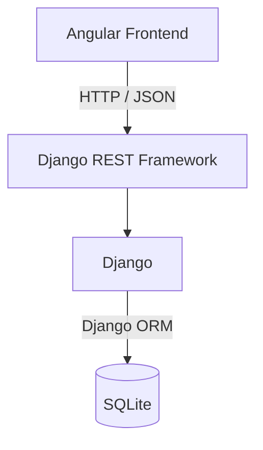

# Bewerbungsmanager (Application Tracker)

## Das Ziel:

Der Bewerbung Tracker soll dabei helfen, Bewerbungen zentral zu verwalten und den aktuellen Stand jeder Bewerbung schnell zu erkennen.

Statt Informationen zu Bewerbungen über Notizen, Tabellen oder verschiedene Dateien zu verteilen, sollen die wichtigsten Daten an einem Ort strukturiert gespeichert werden.

## Hauptworkflow

    Unternehmen anlegen
            ↓
    Bewerbung erstellen
            ↓
    Status verfolgen
            ↓
    Bewerbung aktualisieren
            ↓
    nächste Aktion / Ergebnis

## Tech-Stack:
    
    | Bereich           | Technologie           |
    |   ---             |    ---                |
    | Frontend          | Angular               |
    | Backend           | Django                |
    | REST API          | Django REST Framework |
    | Datenbank         | SQLite                |
    | Kommunikation     | HTTP / JSON           |

## Geplante MVP-Funktionen

    1. Unternehmen erstellen
    2. Unternehmen (eine Liste) anzeigen
    3. Unternehmen bearbeiten
    4. Unternehmen löschen

    5. Bewerbung erstellen
    6. Bewerbung einer Firma zuordnen
    7. Bewerbungen anzeigen
    8. Status ändern
    9. Bewerbung bearbeiten
    10. Bewerbung löschen

### Unternehmen

- Unternehmen anlegen
- Unternehmen anzeigen
- Unternehmen bearbeiten
- Unternehmen löschen

### Bewerbung

- Bewerbung anlegen
- Bewerbung einem Unternehmen zuordnen
- Bewerbung anzeigen
- Bewerbung bearbeiten
- Bewerbung löschen
- Bewerbungsstatus verwalten

### Bewerbungsstatus

- Geplant
- Beworben
- Interview
- Zusage
- Absage

### Dashboard Beispiel

    Bewerbungen insgesamt: 18
    
    Geplant       3
    Beworben      8
    Interview     2
    Zusage        1
    Absage        4

## Datenmodel

### Vorläufiges Datenmodell

Eine Firma kann mehrere Bewerbungen haben.

    Company
    │
    │ 1
    │
    └──────────< Application
                n

### Modellansicht 

    ┌─────────────────────┐
    │       Company       │
    ├─────────────────────┤
    │ id                  │
    │ name                │
    │ website             │
    │ city                │
    │ career_url          │
    │ notes               │
    │ created_at          │
    │ updated_at          │
    └─────────┬───────────┘
            │
            │ 1
            │
            │ n
    ┌─────────▼───────────┐
    │     Application     │
    ├─────────────────────┤
    │ id                  │
    │ company_id          │
    │ position            │
    │ status              │
    │ application_date    │
    │ job_url             │
    │ contact_person      │
    │ contact_email       │
    │ next_action         │
    │ next_action_date    │
    │ notes               │
    │ created_at          │
    │ updated_at          │
    └─────────────────────┘

### Model Company (Unternehmen)

Felder:

    name            CharField           notwendig
    website         URLField            optional
    city            CharField           optional
    career_url      URLField            optional
    notes           TextField           optional
    created_at      DateTimeField       auto
    updated_at      DateTimeField       auto

**Hinweis:**
*Ich erstelle kein Feld für Ansprechpartner:innen, weil es nächste Situation sein könnte:*

    Praktikum → Frau Müller
    Junior Developer → Herr Schmidt
    Werkstudent → Frau Becker

### Model Application (Bewerbung)

Felder:

    company             ForeignKey      notwendig
    position            CharField       notwendig
    status              Choice          notwendig
    application_date    DateField       optional
    job_url             URLField        optional
    contact_person      CharField       optional
    contact_email       EmailField      optional
    next_action         CharField       optional
    next_action_date    DateField       optional
    notes               TextField       optional
    created_at          DateTimeField   auto
    updated_at          DateTimeField   auto

### Feld `status` des Modells `Application` (wählbar)

Werte:

    Jetzt           Später (mit Django)

    PLANNED         Geplant
    APPLIED         Beworben
    INTERVIEW       Interview
    ACCEPTED        Zusage
    REJECTED        Absage

## Systemarchitektur

 

## Welche CRUD-Funktionen sind gebraucht

Model `Company`:

    CREATE          Unternehmen hinzufügen

    READ            Unternehmen anzeigen
    
    UPDATE          Unternehmen bearbeiten

    DELETE          Unternehmen löschen

Model `Application`:

    CREATE          Bewerbung hinzufügen

    READ            Bewerbung anzeigen
    
    UPDATE          Bewerbung bearbeiten

    DELETE          Bewerbung löschen

*Ich verwende `PROTECT` anstatt `CASCADE`, damit `Bewerbungen` nicht versehentlich zusammen mit einem `Unternehmen` gelöscht werden.*

## Business Rules (Fachliche Regeln)

* Jede `Application` gehört genau zu einer `Company`; eine `Company` kann mehrere `Applications` haben.
* Für eine `Application` mit dem Status `geplant` darf kein `application_date` gesetzt sein.
* `next_action` und `next_action_date` beschreiben den nächsten geplanten Schritt.
* Eine `Application` gilt als **überfällig**, wenn `next_action_date` in der Vergangenheit liegt und die Application noch nicht abgeschlossen ist.

## Architekturentscheidung

* Für das MVP bleiben zwei Hauptmodelle: `Company` und `Application`.
* `Application.status` speichert nur den aktuellen Status.
* Eine separate `ApplicationStatusHistory` wird erst in Phase 2 eingeführt.
* `overdue` wird aus den vorhandenen Daten berechnet und nicht als eigenes Boolean-Feld gespeichert.