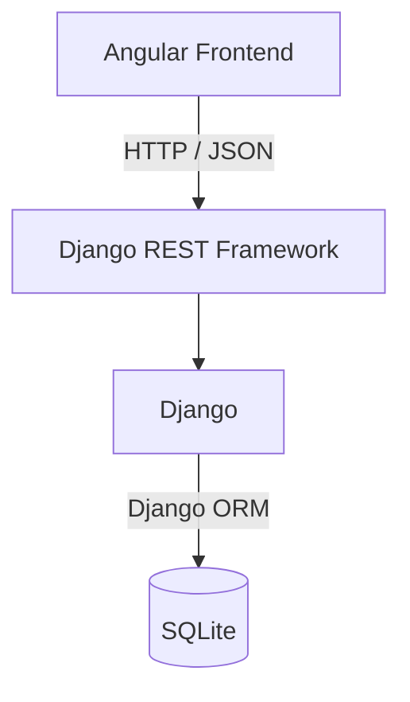

# Bewerbungsmanager (Application Tracker)

## Projektziel

Der Bewerbungsmanager soll dabei helfen, Bewerbungen zentral zu verwalten und den aktuellen Stand jeder Bewerbung schnell zu erkennen.

Statt Informationen zu Bewerbungen über Notizen, Tabellen oder verschiedene Dateien zu verteilen, sollen die wichtigsten Daten an einem Ort strukturiert gespeichert werden.

## Hauptworkflow

```text
Unternehmen anlegen
        ↓
Bewerbung erstellen
        ↓
Status verfolgen
        ↓
Bewerbung aktualisieren
        ↓
nächste Aktion / Ergebnis
```

## MVP-Funktionen

### Unternehmen

- Unternehmen anlegen
- Unternehmen anzeigen
- Unternehmen bearbeiten
- Unternehmen löschen

### Bewerbungen

- Bewerbung anlegen
- Bewerbung einem Unternehmen zuordnen
- Bewerbung anzeigen
- Bewerbung bearbeiten
- Bewerbung löschen
- Bewerbungsstatus verwalten

## Tech-Stack

| Bereich | Technologie |
|---|---|
| Frontend | Angular |
| Backend | Django |
| REST API | Django REST Framework |
| Datenbank | SQLite |
| Kommunikation | HTTP / JSON |

## Systemarchitektur



## Datenmodell

### Beziehung zwischen den Modellen

Eine `Company` kann mehrere `Applications` haben.

```text
Company
   1
   │
   └──────< Application
              n
```

### Modellansicht

```text
┌─────────────────────┐
│       Company       │
├─────────────────────┤
│ id                  │
│ name                │
│ website             │
│ city                │
│ career_url          │
│ notes               │
│ created_at          │
│ updated_at          │
└─────────┬───────────┘
          │
          │ 1
          │
          │ n
┌─────────▼───────────┐
│     Application     │
├─────────────────────┤
│ id                  │
│ company_id          │
│ position            │
│ status              │
│ application_date    │
│ job_url             │
│ contact_person      │
│ contact_email       │
│ next_action         │
│ next_action_date    │
│ notes               │
│ created_at          │
│ updated_at          │
└─────────────────────┘
```

### Modell `Company`

| Feld | Django-Feld | Pflicht |
|---|---|---|
| `name` | `CharField` | ja |
| `website` | `URLField` | nein |
| `city` | `CharField` | nein |
| `career_url` | `URLField` | nein |
| `notes` | `TextField` | nein |
| `created_at` | `DateTimeField` | automatisch |
| `updated_at` | `DateTimeField` | automatisch |

**Architekturhinweis:**  
Kontaktpersonen werden nicht direkt in `Company` gespeichert, weil unterschiedliche Bewerbungen bei derselben Firma unterschiedliche Ansprechpartner haben können.

Beispiel:

```text
Praktikum         → Frau Müller
Junior Developer  → Herr Schmidt
Werkstudent       → Frau Becker
```

### Modell `Application`

| Feld | Django-Feld | Pflicht |
|---|---|---|
| `company` | `ForeignKey` | ja |
| `position` | `CharField` | ja |
| `status` | `Choice` | ja |
| `application_date` | `DateField` | nein |
| `job_url` | `URLField` | nein |
| `contact_person` | `CharField` | nein |
| `contact_email` | `EmailField` | nein |
| `next_action` | `CharField` | nein |
| `next_action_date` | `DateField` | nein |
| `notes` | `TextField` | nein |
| `created_at` | `DateTimeField` | automatisch |
| `updated_at` | `DateTimeField` | automatisch |

> Optional bedeutet hier: Das Feld ist Teil des Modells, muss aber nicht zwingend ausgefüllt werden.

## Bewerbungsstatus

| API-/DB-Wert | Anzeige |
|---|---|
| `PLANNED` | Geplant |
| `APPLIED` | Beworben |
| `INTERVIEW` | Interview |
| `ACCEPTED` | Zusage |
| `REJECTED` | Absage |

## Benötigte CRUD-Funktionen

### `Company`

| Operation | Funktion |
|---|---|
| CREATE | Unternehmen hinzufügen |
| READ | Unternehmen anzeigen |
| UPDATE | Unternehmen bearbeiten |
| DELETE | Unternehmen löschen |

### `Application`

| Operation | Funktion |
|---|---|
| CREATE | Bewerbung hinzufügen |
| READ | Bewerbung anzeigen |
| UPDATE | Bewerbung bearbeiten |
| DELETE | Bewerbung löschen |

Für die Beziehung zwischen `Application` und `Company` soll `PROTECT` statt `CASCADE` verwendet werden, damit Bewerbungen nicht versehentlich zusammen mit einem Unternehmen gelöscht werden.

## Business Rules

- Jede `Application` gehört genau zu einer `Company`; eine `Company` kann mehrere `Applications` haben.
- Für eine `Application` mit dem Status `PLANNED` darf kein `application_date` gesetzt sein.
- `next_action` und `next_action_date` beschreiben den nächsten geplanten Schritt.
- Eine `Application` gilt als **überfällig**, wenn `next_action_date` in der Vergangenheit liegt und die Bewerbung noch nicht abgeschlossen ist.

## Architekturentscheidungen

- Für das MVP bleiben zwei Hauptmodelle: `Company` und `Application`.
- `Application.status` speichert nur den aktuellen Status.
- Eine separate `ApplicationStatusHistory` wird erst in Phase 2 eingeführt.
- `overdue` wird aus den vorhandenen Daten berechnet und nicht als eigenes Boolean-Feld gespeichert.
- Kontaktinformationen zu Ansprechpartnern werden auf Ebene der `Application` gespeichert, nicht auf Ebene der `Company`.

## Geplante Erweiterungen – Phase 2

- Dashboard mit Statistiken
- Überfällige Follow-ups
- Filter „keine Antwort seit mehr als 14 Tagen“
- `ApplicationStatusHistory`

## Projektstatus

### Meilenstein 1 – Projektdefinition und Datenmodell

- [x] Projektidee, Hauptworkflow, MVP und Definition of Done definiert
- [x] Fachliche Anforderungen definiert
- [x] Datenmodell entworfen
- [x] Status und Business Rules definiert
- [x] Architekturentscheidungen dokumentiert
- [x] README für Meilenstein 1 konsolidiert

### Meilenstein 2 – Backend-Grundlage

- [x] Backend-Umgebung eingerichtet
- [x] Django-Projekt erstellt
- [x] Django-App `applications` erstellt
- [x] Django REST Framework integriert
- [x] Backend erfolgreich gestartet

### Meilenstein 3 – Django-Datenmodell

- [x] Modelle `Company` und `Application` implementiert
- [x] 1:n-Beziehung umgesetzt
- [x] Bewerbungsstatus mit `TextChoices` definiert
- [x] Migration erstellt und angewendet
- [x] Modelle im Django Admin geprüft

### Meilenstein 4 – REST API

- [x] Serializer für Company und Application implementiert
- [x] Business Validation hinzugefügt
- [x] CRUD-Endpunkte erstellt
- [x] API-Routing konfiguriert
- [x] Suche implementiert
- [x] Filter nach Bewerbungsstatus implementiert
- [x] API manuell geprüft

### Meilenstein 5 – Backend-Tests

- [x] Datenmodell getestet
- [x] `PROTECT`-Verhalten getestet
- [x] REST-API getestet
- [x] Business Validation getestet
- [x] Statusfilter getestet
- [x] Suchfunktion getestet

### Meilenstein 6 – Angular-Grundlage

- [x] Angular-Projekt erstellt
- [x] grundlegende Seiten erstellt
- [x] Routing eingerichtet
- [x] Navigation funktioniert
- [x] Development Server geprüft
- [x] Production Build geprüft

### Nächster Schritt

**Meilenstein 7 – Frontend-Backend-Integration**