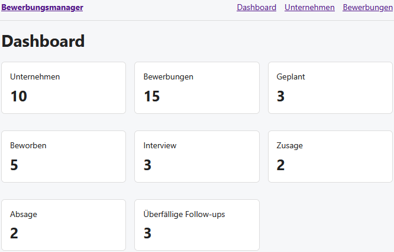
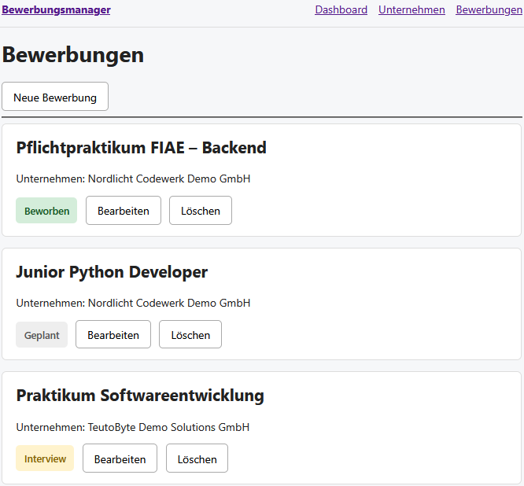
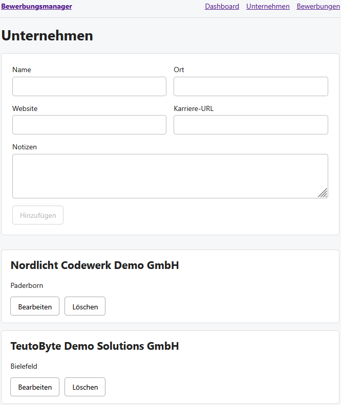
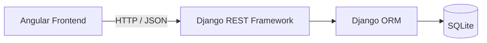

# Bewerbungsmanager

Eine Full-Stack-Webanwendung zur strukturierten Verwaltung von Unternehmen, Bewerbungen, Bewerbungsstatus und Follow-ups.

Das Projekt entstand als Portfolio- und Lernprojekt im Rahmen meiner Umschulung zum **Fachinformatiker für Anwendungsentwicklung (FIAE)**. Ziel war es, einen vollständigen Entwicklungsprozess praktisch umzusetzen: von der fachlichen Planung und Datenmodellierung über eine REST-API bis zur Integration eines Angular-Frontends.

<!--
## Screenshots

> Die Bilddateien können nach dem finalen Portfolio-Check unter
> `docs/screenshots/` abgelegt und dieser Block anschließend aktiviert werden.

### Dashboard



### Bewerbungen



### Unternehmen


-->

## Funktionen

- Unternehmen erstellen, anzeigen, bearbeiten und löschen
- Bewerbungen einem Unternehmen zuordnen und verwalten
- Bewerbungsstatus verfolgen: `Geplant`, `Beworben`, `Interview`, `Zusage`, `Absage`
- Ansprechpartner, Stellenanzeige, Notizen und nächste Aktionen erfassen
- überfällige Follow-ups automatisch anhand des nächsten Aktionsdatums erkennen
- Dashboard mit Bewerbungsstatistiken und Statusverteilung
- REST-API mit Suche und Filterung
- fachliche Regeln im Backend validieren
- erwartete API-Konflikte mit passenden HTTP-Statuscodes behandeln
- verständliche Fehlermeldungen im Angular-Frontend anzeigen
- relevante Backend-Ereignisse über Django-Logging protokollieren
- zentrale Backend-Funktionen durch automatisierte Tests prüfen

## Tech-Stack

| Bereich | Technologie |
|---|---|
| Frontend | Angular 22, TypeScript, Reactive Forms, Signals |
| Backend | Python, Django 6.1 |
| REST API | Django REST Framework 3.18 |
| Datenbank | SQLite |
| Kommunikation | HTTP / JSON |
| Versionsverwaltung | Git / GitHub |

## Architektur



Im Frontend sind Seitenlogik und HTTP-Zugriffe getrennt: Angular-Komponenten verwenden API-Services, die über `HttpClient` mit dem Backend kommunizieren. Reactive Forms werden für die Eingabe verwendet, Signals für den lokalen UI-Zustand.

Im Backend übernehmen Django-Modelle und ORM die Datenhaltung. Django REST Framework stellt Serializers, ViewSets und einen separaten Dashboard-Endpunkt bereit.

## Datenmodell

Die zentrale Beziehung des Projekts ist:

```text
Company 1 ───────── n Application
```

Eine `Company` kann mehrere `Applications` haben. Jede `Application` gehört genau zu einer `Company`.

### Zentrale Business Rules

- Eine Bewerbung mit dem Status `PLANNED` darf kein `application_date` besitzen.
- Unternehmen mit vorhandenen Bewerbungen können wegen `PROTECT` nicht gelöscht werden.
- Ein geschützter Löschversuch wird über die API als `409 Conflict` zurückgegeben.
- `next_action` und `next_action_date` beschreiben den nächsten geplanten Schritt.
- Eine Bewerbung gilt als überfällig, wenn `next_action_date` in der Vergangenheit liegt und die Bewerbung noch nicht mit `ACCEPTED` oder `REJECTED` abgeschlossen ist.
- Der Zustand `overdue` wird berechnet und nicht als eigenes Datenbankfeld gespeichert.
- Ansprechpartner und Kontakt-E-Mail werden auf Ebene der Bewerbung gespeichert, da ein Unternehmen bei verschiedenen Bewerbungen unterschiedliche Ansprechpartner haben kann.

## Bewerbungsstatus

| API-/DB-Wert | Anzeige |
|---|---|
| `PLANNED` | Geplant |
| `APPLIED` | Beworben |
| `INTERVIEW` | Interview |
| `ACCEPTED` | Zusage |
| `REJECTED` | Absage |

## REST API

| Methode | Endpoint | Funktion |
|---|---|---|
| `GET`, `POST` | `/api/companies/` | Unternehmen anzeigen / erstellen |
| `GET`, `PATCH`, `DELETE` | `/api/companies/{id}/` | einzelnes Unternehmen verwalten |
| `GET`, `POST` | `/api/applications/` | Bewerbungen anzeigen / erstellen |
| `GET`, `PATCH`, `DELETE` | `/api/applications/{id}/` | einzelne Bewerbung verwalten |
| `GET` | `/api/dashboard/` | Dashboard-Statistiken abrufen |

### Suche und Filter

Beispiele:

```text
/api/companies/?search=Paderborn
/api/applications/?search=Python
/api/applications/?status=APPLIED
```

Die Unternehmenssuche berücksichtigt unter anderem Name und Ort. Bewerbungen können unter anderem nach Position, Unternehmen oder Ansprechpartner gesucht und nach Status gefiltert werden.

## Dashboard

Das Dashboard stellt eine kompakte Übersicht bereit:

- Anzahl der Unternehmen
- Gesamtzahl der Bewerbungen
- Anzahl der Bewerbungen je Status
- Anzahl überfälliger Follow-ups

Die Statistik wird im Backend über Django ORM berechnet und über einen eigenen REST-Endpunkt an Angular geliefert.

## Fehlerbehandlung und Logging

Die Anwendung behandelt erwartbare Fehler sowohl im Backend als auch im Frontend.

Beispiele:

- ungültige fachliche Daten werden als `400 Bad Request` zurückgegeben
- das Löschen eines Unternehmens mit vorhandenen Bewerbungen führt zu `409 Conflict`
- Angular verarbeitet API-Fehler zentral und zeigt verständliche Meldungen an
- Statusänderungen und blockierte Löschvorgänge werden im Backend protokolliert
- Django-Request-Fehler ab `WARNING` werden über Console-Logging ausgegeben

Personenbezogene Notizen oder vollständige Request-Inhalte werden nicht gezielt in den Anwendungslogs protokolliert.

## Lokaler Start

### Voraussetzungen

- Python
- Node.js und npm
- Git

### Backend

```bash
cd backend
python -m venv .venv
```

Windows PowerShell:

```powershell
.\.venv\Scripts\Activate.ps1
$env:DJANGO_SECRET_KEY="local-development-key"
```

Linux / macOS:

```bash
source .venv/bin/activate
export DJANGO_SECRET_KEY="local-development-key"
```

Abhängigkeiten installieren und Datenbank vorbereiten:

```bash
python -m pip install -r requirements.txt
python manage.py migrate
python manage.py runserver
```

Das Backend läuft anschließend standardmäßig unter:

```text
http://127.0.0.1:8000/
```

### Frontend

In einem zweiten Terminal:

```bash
cd frontend
npm ci
npm start
```

Das Frontend läuft anschließend standardmäßig unter:

```text
http://localhost:4200/
```

## Tests und Build

Die Backend-Tests prüfen unter anderem:

- `Company`-`Application`-Beziehung
- Löschschutz durch `PROTECT`
- REST-API
- fachliche Validierung
- Suche und Statusfilter
- Dashboard-Statistiken und überfällige Follow-ups

Backend-Tests ausführen:

```bash
cd backend
python manage.py test
```

Angular Production Build prüfen:

```bash
cd frontend
npm run build
```

## Projektstruktur

```text
bewerbungsmanager/
├── backend/
│   ├── applications/
│   │   ├── migrations/
│   │   ├── admin.py
│   │   ├── models.py
│   │   ├── serializers.py
│   │   ├── tests.py
│   │   ├── urls.py
│   │   └── views.py
│   ├── config/
│   ├── manage.py
│   └── requirements.txt
│
├── frontend/
│   ├── src/app/
│   │   ├── models/
│   │   ├── pages/
│   │   ├── services/
│   │   └── utils/
│   ├── package.json
│   └── package-lock.json
│
├── docs/
│   └── screenshots/        # optional für Portfolio-Screenshots
│
├── .gitignore
└── README.md
```

## Entwicklungsprozess

Das Projekt wurde schrittweise über **GitHub Milestones und Issues** entwickelt. Größere Änderungen wurden in eigenen Branches umgesetzt und über Pull Requests in `main` integriert.

Dabei wurden unter anderem folgende Arbeitsweisen praktisch geübt:

- Anforderungen in überschaubare Meilensteine zerlegen
- Datenmodell und Business Rules vor der Implementierung definieren
- Änderungen in logisch abgegrenzten Commits festhalten
- Feature-Branches und Pull Requests verwenden
- Backend und Frontend getrennt entwickeln und anschließend integrieren
- wichtige fachliche Regeln durch Tests absichern
- technische Entscheidungen und geplante Erweiterungen dokumentieren

Die detaillierte Entwicklungshistorie ist über Issues, Milestones, Commits und Pull Requests im Repository nachvollziehbar.

## Einsatz von KI

Bei der Entwicklung dieses Projekts wurden KI-Tools unterstützend eingesetzt, unter anderem für **Erklärungen, Codevorschläge, Refactoring-Ideen und Fehlersuche**.

Die Vorschläge wurden schrittweise in den Projektkontext eingeordnet, angepasst und überprüft. Architekturentscheidungen, fachliche Regeln und technische Lösungen wurden im Verlauf des Projekts diskutiert, praktisch umgesetzt und anhand des funktionierenden Zusammenspiels von Backend, REST-API, Tests und Frontend nachvollzogen.

Ziel des Projekts war nicht nur, funktionierenden Code zu erstellen, sondern den Entwicklungsprozess und die verwendeten Konzepte praktisch zu verstehen und reproduzieren zu können.

## Geplante Erweiterungen

Bewusst nicht Teil des aktuellen MVP:

- Statushistorie einer Bewerbung (`ApplicationStatusHistory`)
- Filter „keine Antwort seit mehr als 14 Tagen“

Diese Erweiterungen sind vorgesehen, ohne die aktuelle MVP-Struktur unnötig zu vergrößern.